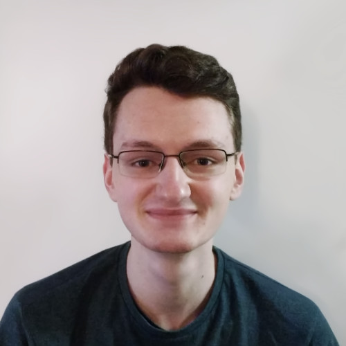

# Brett Doyle
I'm a 20 year old programmer & 3D artist, who currently lives in Hampton, London.

I've been doing 3D modelling since 2013. I first got interested in it while making custom maps and models for a game I used to play.
Since then I've learnt and experimented with many different 3D tools and applications (starting with 3DS Max), and also learnt a few programming languages which I've used for both 3D and 2D creative coding (as well as some web design and software tools).

From the start, I've wanted to use digital 3D as an artistic medium, and have actively worked at improving my artistic and technical abilities.
I enjoy digital sculpture the most, and am inspired by artists such as Simon Stålenhag, Olly Moss, and Pascal Blanché.
My spare time is spent drawing, coding, and reading (mainly science fiction).

In 2017-2018 I completed a Diploma of Advanced 3D Modelling with CG Spectrum.
During my time with CG Spectrum I learnt character and creature sculpting, and greatly improved previously self-taught modelling and texturing skills.
